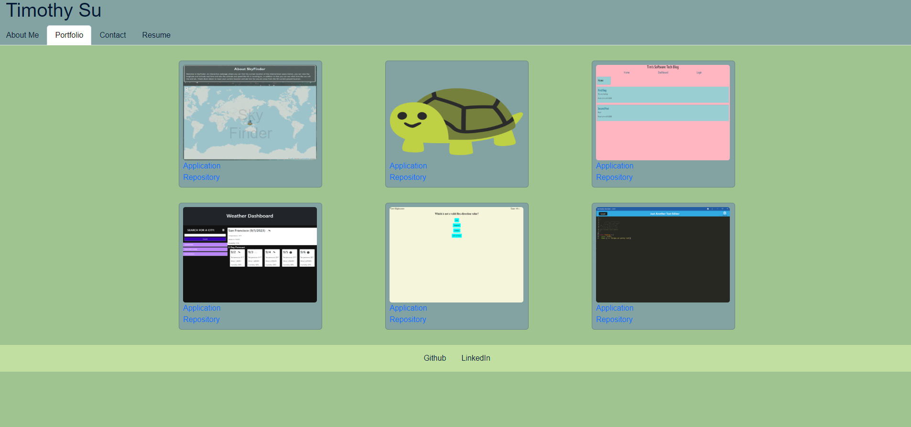

# React Portfolio

## Description
This is my portfolio page that i built with React and is for all of my coding projects. 

[Deployed Link](https://main--timothy-su-portfolio.netlify.app/)



## Built With
* [JavaScript](https://developer.mozilla.org/en-US/docs/Web/JavaScript)
* [HTML](https://developer.mozilla.org/en-US/docs/Web/HTML)
* [CSS](https://developer.mozilla.org/en-US/docs/Web/CSS)
* [Git](https://git-scm.com/)
* [Express](https://expressjs.com/en/guide/routing.html)
* [React](https://react.dev/learn)
* [Netlify](https://docs.netlify.com/?_gl=1%2a8ipq6z%2a_gcl_au%2aNDg0ODU1MzcxLjE2OTM2MjkzNjY.)

## Usage
The user can navigate to the deployed site and will arrive on the about me portion by default. They can the use the nav bar to go to their desired portion of the page.

## Learning Points
* Creating front-end HTML with React
* Using state variables to keep track of info on a page
* Deployeing fron-end applications with Netlify


## Important Code
```js
  const handleChange = (e) => {
    switch (e.target.id) {
      case 'nameInput':
        setName(e.target.value)
        break;
      case 'emailInput':
        setEmail(e.target.value)
        break;
      case 'messageInput':
        setMessage(e.target.value)
        break;
    }
  }
```
This code sets the value of the state variables depending on the user input

## Author Info

### Timothy Su

* [LinkedIn](https://www.linkedin.com/in/timothysu1/)
* [Github](https://github.com/timothysu1)

## License

Please refer to license in the repo. 

## Contributions
N/A
